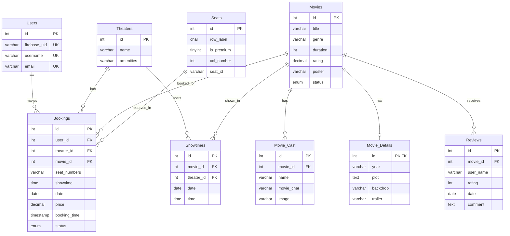

```mermaid
erDiagram
    Users ||--o{ Bookings : makes
    Theaters ||--o{ Showtimes : hosts
    Movies ||--o{ Showtimes : shown_in
    Movies ||--o{ Movie_Cast : has
    Movies ||--o| Movie_Details : has
    Movies ||--o{ Reviews : receives
    Theaters ||--o{ Bookings : has
    Movies ||--o{ Bookings : booked_for
    Seats ||--o{ Bookings : reserved_in

    Users {
        int id PK
        varchar firebase_uid UK
        varchar username UK
        varchar email UK
    }

    Theaters {
        int id PK
        varchar name
        varchar amenities
    }

    Movies {
        int id PK
        varchar title
        varchar genre
        int duration
        decimal rating
        varchar poster
        enum status
    }

    Movie_Cast {
        int id PK
        int movie_id FK
        varchar name
        varchar movie_char
        varchar image
    }

    Movie_Details {
        int id PK,FK
        varchar year
        text plot
        varchar backdrop
        varchar trailer
    }

    Reviews {
        int id PK
        int movie_id FK
        varchar user_name
        int rating
        date date
        text comment
    }

    Showtimes {
        int id PK
        int movie_id FK
        int theater_id FK
        date date
        time time
    }

    Seats {
        int id PK
        char row_label
        tinyint is_premium
        int col_number
        varchar seat_id
    }

    Bookings {
        int id PK
        int user_id FK
        int theater_id FK
        int movie_id FK
        varchar seat_numbers
        time showtime
        date date        decimal price
        timestamp booking_time
        enum status
        %% Note: Unique constraint on (theater_id, movie_id, seat_number, showtime, date)
    }
```